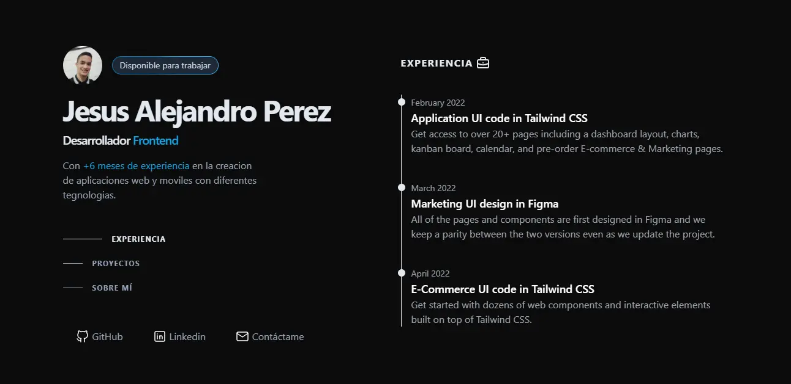

# Mi Portafolio

¡Bienvenido a mi portafolio! Aquí encontrarás una recopilación de mis proyectos más destacados donde podras conoces más sobre mi experiencia, habilidades y las tecnología que utilizo para desarrollarlos.

## Capturas de Pantalla

## Características

- 🖥️ Diseño Resposive
- ⚡ Altamente Performante
- 🔍 SEO Optimizado
- 💼 Proyectos Destacados

## Tecnologías Usadas

- **Frontend**: HTML5, Tailwind CSS, JavaScript
- **Herramientas**: Git, GitHub, VSCode, Figma

## 
